# Breeder App — produkto srautų ir UX architektūros auditas (GALUTINĖ VERSIJA)

> **ĮGYVENDINIMO BŪSENA (2026-07-13 naktis):** galutinio sąrašo (§7.2) punktai **#1–#11 įgyvendinti** ir išpushinti į staging (commit'ai `1b13908`, `9d5de06`, `54b5d34`), papildomai — Android „atgal" gesto uždarymas overlay'ams (`lib/backClose.ts`) ir QA checklist'o FAIL'ai CASC-09/CASC-10/TASK-13/DATA-03/DOC-06/BUY-06 + BUY-04/05. §1–§2 diagramos žemiau rodo būseną **prieš** pertvarką (audito faktinė medžiaga); **naujasis** srautų žemėlapis ir UAT scenarijai — [UAT_GUIDE.md](UAT_GUIDE.md). Vidutinio/žemo prioriteto uodega (§7.2 apačia) lieka backlog'e.

**Data:** 2026-07-13 · **Būsena:** po „Journey" redizaino (DESIGN_OVERHAUL_SPEC v1)
**Metodika:** trys nepriklausomi šaltiniai, sulieti per priešiškus raundus:
- **Auditas A** — Claude (3 lygiagretūs kodo žvalgybos agentai, visa `app/src/`);
- **Auditas B** — nepriklausomo recenzento ataskaita (visi faktiniai teiginiai patikrinti kode — **visi pasitvirtino**);
- **Codex** — priešiškas recenzentas (2 raundai: kritika + atsakymai į iššūkius), radęs 6 naujus radinius.
Kiekvienas radinys turi failas:eilutė nuorodą. Ginčytini klausimai išspręsti §9.

---

## 0. Santrauka (TL;DR)

Bendra architektūra po redizaino yra **gera**: 4 mobilūs tabai, 8 desktop meniu punktai, vienas vados fokusas, FAB reiškia „pridėti į šią vadą". Pagrindinė problema — **ne trūkstamas funkcionalumas, o tai, kad dalis funkcijų pateiktos kaip lygiavertės „vietos", nors iš tiesų yra kontekstiniai veiksmai** prie vados / šuniuko / pirkėjo / šuns. Kritinės spragos:

1. **„Puppies & care" nėra „care" centras.** Tabas pretenduoja į `/weigh-in`, `/health-log`, `/whelping` (`AppShell.tsx:282`), bet ekrane nėra nė vienos nuorodos į juos (spec §2.1 liko neįgyvendintas). Tuščia būsena mini „birth log", bet neduoda mygtuko (`Puppies.tsx:59`).
2. **Vieno konteksto klaida (rimčiausia, rado Codex):** atsidarius neaktyvią/archyvuotą vadą (`Litters.tsx:71-74` aktyvia nustato tik aktyvias), LitterInfo mygtukai „Weigh-in / Health log / Birth log" atidaro **aktyvios** vados ekranus — galima įrašyti duomenis ne tai vadai (`WeighIn.tsx:23-29`, `HealthLog.tsx:17-21`, `BirthLog.tsx:23-25`).
3. **Desktope `/dogs` beveik nepasiekiamas** — sidebar „Dogs & litters" veda į `/litters`, kuris šunų nerodo ir nelinkuoja; svėrimas/sveikata/atsivedimas pasiekiami tik per LitterInfo.
4. **FAB pusiau sugedęs:** „Note" = „Task" dublikatas (`AppShell.tsx:255,258`); „Expense" veda į ekraną, nors `?new=1` deep-link'as yra (`Expenses.tsx:41`); nėra sveikatos įrašo; nerodomas turėtų būti ir `/whelping`.
5. **Trys našlaičiai maršrutai** (`/all-documents`, `/all-buyers`, `/all-expenses`) + negyvas `TaskViewToggle` + neimportuotas `DocGenerateSheet`. `/all-documents` skaito kitą lentelę (`documents`) nei `/docs` (`uploads`) — dvi „visų dokumentų" visatos, viena jų be duomenų šaltinio.
6. **Esybės — aklavietės.** Šuniukas↔pirkėjas nesusieti nuorodomis nė viena kryptimi; `OwnerRecord` rodo tik **pirmą** susietą šuniuką (`.find()`, `OwnerRecord.tsx:14`); iš šuniuko negalima nei pasverti, nei pridėti sveikatos įrašo/užduoties/dokumento.
7. **Paieška ir notifikacijos atidaro „apytiksliai":** užduoties rezultatas tik perjungia vadą ir atidaro `/plan` be detalės (`Search.tsx:32-35`; `?task=` param neegzistuoja); šuniuko/pirkėjo rezultatai neperjungia vados konteksto; upload'ų paieška neieško; notifikacijos veda į plačius ekranus, nors `kind` leidžia atidaryti tikslų taikinį be DB pakeitimų (`Notifications.tsx:26-42`, `actions.ts:50-52`).

---

## 1. Pilnas programos srautų žemėlapis

### 1.1 Dabartinė navigacija

**Mobili (4 tabai + FAB):**

```mermaid
flowchart TD
    subgraph BottomBar["Apatinė juosta (mobili)"]
        HOME["Home /"]
        PLAN["Plan /plan"]
        PUPS["Puppies /puppies"]
        KEN["Kennel /kennel (Menu)"]
    end

    HOME -->|"UP NEXT 'Start'"| WEIGH["/weigh-in"]
    HOME -->|"svorio įspėjimas"| WEIGH
    HOME -->|kortelės| PUPS
    HOME -->|Money kortelė| EXP["/expenses"]
    HOME -->|"Next heat"| DOGS["/dogs"]
    HOME -->|"Coming up"| PLAN

    PLAN --> LIST["List (Timeline)"]
    PLAN --> GANTT["Gantt"]
    PLAN --> ROUT["Routines (Ongoing)"]

    PUPS --> PPROF["/puppies/:id (profilis)"]
    PPROF --> PEDIT["/puppies/:id/edit"]
    PPROF --> HAND["Handover checklist (sheet)"]
    PUPS -.->|"NĖRA nuorodų!"| WEIGH
    PUPS -.->|"NĖRA nuorodų!"| HL["/health-log"]
    PUPS -.->|"NĖRA nuorodų!"| WH["/whelping (BirthLog)"]

    KEN --> WH
    KEN --> WEIGH
    KEN --> HL
    KEN --> EXP
    KEN --> BUY["/buyers"]
    KEN --> DOCS["/docs"]
    KEN --> ROUT
    KEN --> DOGS
    KEN --> LITT["/litters"]
    KEN --> TEAM["/team"]
    KEN --> NOTIF["/notifications"]
    KEN --> SETT["/settings"]

    FAB(("FAB +")) --> FTASK["Task → TaskFormSheet"]
    FAB --> FWEIGH["Weigh-in → /weigh-in"]
    FAB --> FEXP["Expense → /expenses (ne forma!)"]
    FAB --> FNOTE["Note → TaskFormSheet (dublikatas)"]

    LITT --> LINFO["/litters/:id (LitterInfo)"]
    LINFO --> WH
    LINFO --> WEIGH
    LINFO --> HL
    LINFO --> CLOSE["/close-out"]
```

**Desktop (sidebar, 8 punktai):**

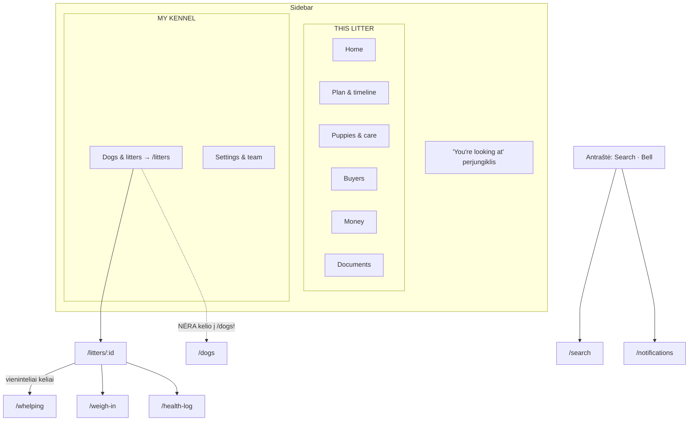

### 1.2 Maršrutų inventorius

| Maršrutas | Ekranas | Pasiekiamumas |
|---|---|---|
| `/` | Home (Today + Dashboard sulieta) | Tabas / sidebar |
| `/plan` (+`?tab=`) | Plan: List · Gantt · Routines | Tabas / sidebar |
| `/puppies`, `/puppies/:id`, `/puppies/:id/edit` | Šuniukai | Tabas / sidebar |
| `/kennel` | Menu (mobilus centras, 12 punktų) | Tabas |
| `/litters`, `/litters/:id`, `/litters/new` | Vados, vados kortelė, vedlys | Sidebar / Menu |
| `/dogs` | Šunys | **Tik Menu + Home „Next heat"** |
| `/weigh-in` | Svėrimo srautas | Menu, LitterInfo, FAB, Home |
| `/health-log` | Sveikatos žurnalas | Menu, LitterInfo |
| `/whelping` | Atsivedimo naktis (BirthLog) | Menu, LitterInfo |
| `/buyers`, `/owners/:id` | Pirkėjai | Sidebar / Menu |
| `/expenses` | Pinigai | Sidebar / Menu / FAB |
| `/docs`, `/docs/:id` | Dokumentai (uploads) / PDF žiūryklė | Sidebar / Menu |
| `/close-out` | Vados uždarymas | LitterInfo |
| `/team`, `/settings`, `/profile`, `/search`, `/notifications` | Sistema | Antraštė / Menu / sidebar |
| `/all-documents`, `/all-buyers`, `/all-expenses` | Agregatai | **NAŠLAIČIAI — nepasiekiami** |
| `/today`, `/tasks`, `/gantt`, `/ongoing`, `/menu` | Redirect'ai | — |

### 1.3 Gyvavimo ciklas (organizuojantis principas)

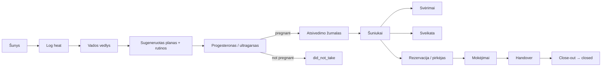

UI turėtų siūlyti **kitą natūralų ciklo veiksmą pagal vados būseną**, o ne rodyti visus veiksmus kaip lygiaverčius meniu punktus.

---

## 2. Esybių srautų diagramos

### 2.1 Šunys (Dogs)

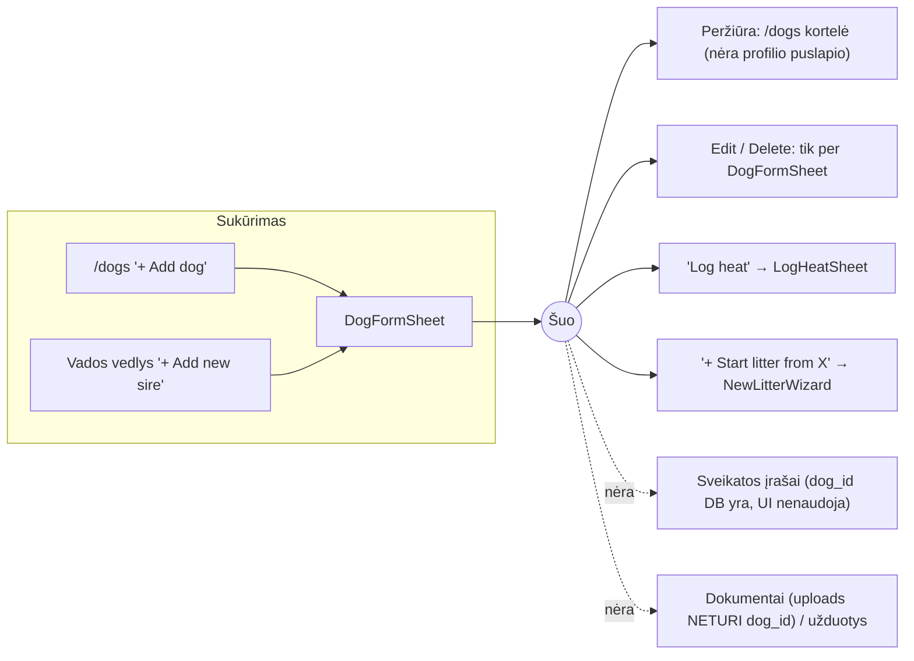

### 2.2 Vados (Litters) — būsenos

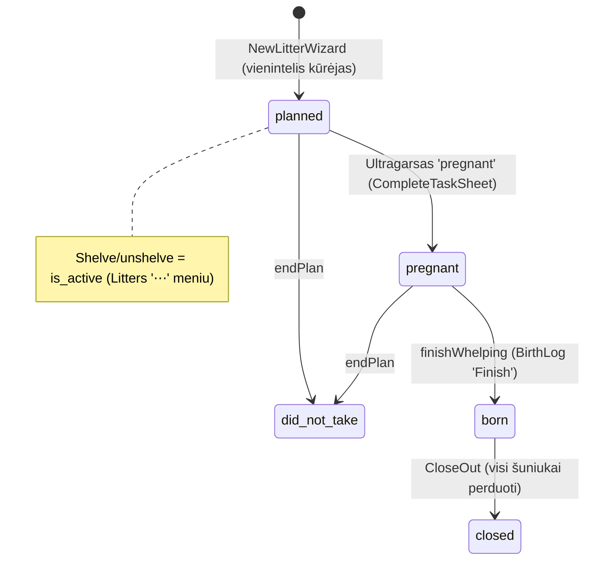

- Kūrimo įėjimai gerai (daug), bet **nesuderinti**: LitterSwitcher → `/dogs?new_litter=1` vietoj `/litters/new` (`LitterSwitcherSheet.tsx:74-82`); vedlio submit → miręs `/tasks` (`NewLitterWizard.tsx:118`); `/litters` tuščia būsena siūlo „New litter" net be šunų, nors vedliui reikia kalės (`Litters.tsx:80-81` vs `NewLitterWizard.tsx:143-147`) — Home tokiu atveju teisingai siunčia į `/dogs`.

### 2.3 Šuniukai (Puppies)

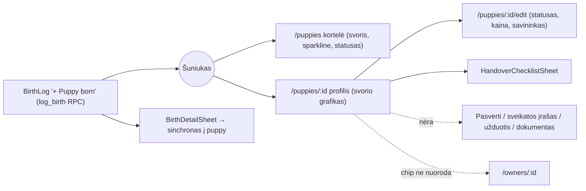

### 2.4 Svėrimai (Weigh-ins)

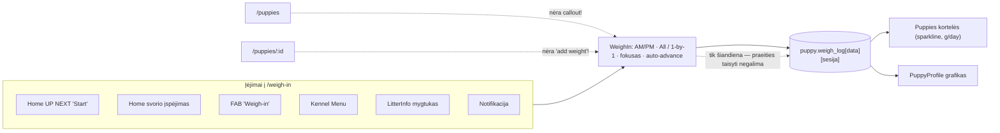

**Verdiktas:** svėrimas teisingai yra fokusuotas režimas, ne nav. sekcija — bet **per daug reklamuojamas ne ten** (Kennel meniu) ir **nepasiekiamas ten, kur natūraliausia** (Puppies, PuppyProfile). Pridėtinas `/weigh-in?puppy=<id>` preselekcijai iš profilio.

### 2.5 Sveikatos įrašai (Health log)

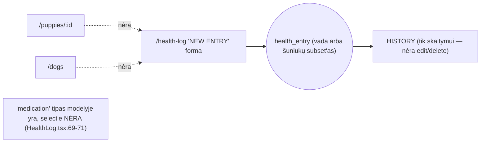

### 2.6 Užduotys ir rutinos

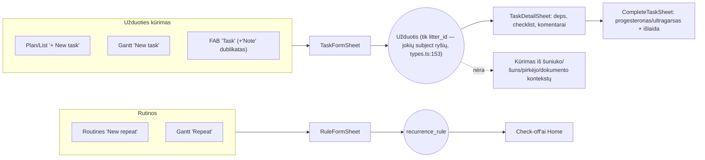

### 2.7 Dokumentai — DVI atskiros sistemos

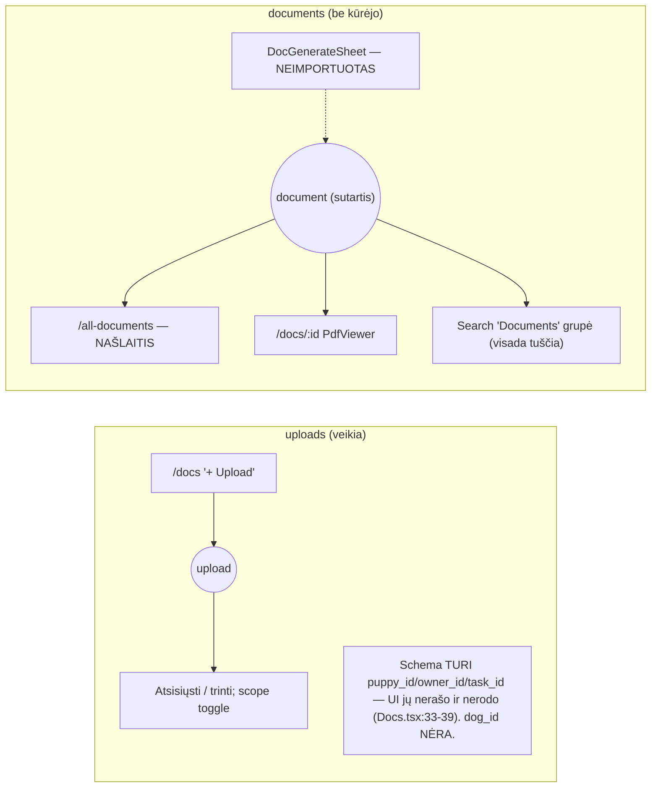

Dizaino handoff'as (SPEC.md:91, FLOWS.md:20) numato centrinį dokumentų paviršių su „missing fields" ir statuso timeline — tai **vėlesnės unifikacijos taikinys**, kai sutarčių generavimas bus atparkuotas (žr. §9.4).

### 2.8 Pirkėjai / pardavimas

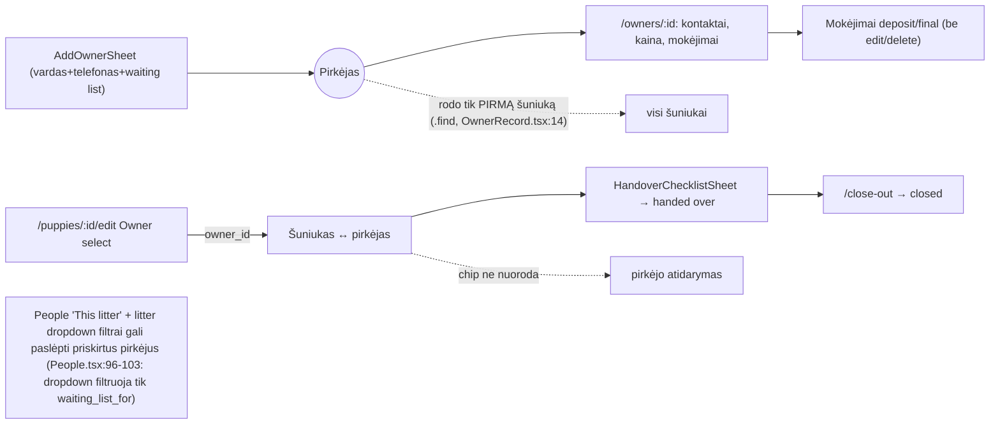

- Rezervacija = 3 rankiniai žingsniai trijuose ekranuose; nėra „waiting list → reserved" konversijos veiksmo (handoff FLOWS.md:20 numato „reserve" žingsnį).

### 2.9 Išlaidos

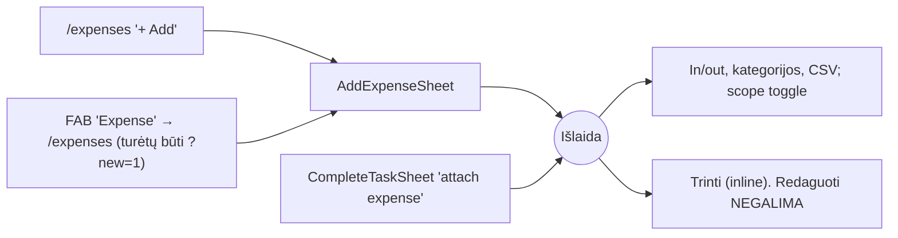

---

## 3. Dublikatų / ne vietoje esančių funkcijų auditas

| # | Radinys | Dabartinė elgsena | Kodėl trukdo | Rekomendacija | Verdiktas |
|---|---|---|---|---|---|
| D1 | **FAB „Note" = „Task"** (`AppShell.tsx:255,258`) | Abu atidaro `TaskFormSheet` | 2 mygtukai — 1 funkcija | Pakeisti į „Health entry" | **Pakeisti** |
| D2 | **FAB „Expense" veda į ekraną** | `navigate('/expenses')` be formos | Papildomas žingsnis, nenuoseklu | `→ /expenses?new=1` (`Expenses.tsx:41`) | **Pataisyti** |
| D3 | **`/all-*` našlaičiai** (`Aggregates.tsx`) | Niekas nelinkuoja; pakeitė scope toggle'ai | Negyvas kodas; `/all-documents` rodo kitą lentelę nei `/docs` | Ištrinti maršrutus + `Aggregates.tsx`; „Unassigned" išlaidas perkelti į `/expenses` „All" scope | **Pašalinti** |
| D4 | **`TaskViewToggle` negyvas** | Renderinamas tik `!embedded`; visada embedded | Naviguoja į redirect maršrutus | Ištrinti | **Pašalinti** |
| D5 | **Kennel Menu (12 punktų) semantika** | Litter-scoped įrankiai (Whelping, Weigh-ins, Health log, Routines) po „Kennel"; „Dogs & litters"→`/dogs` ir „Litters"→`/litters` atskirai; sidebar'e „Dogs & litters"→`/litters` | Trys skirtingi „Dogs & litters"; „Kennel" maišo lygmenis | Care punktus išimti (po to, kai Puppies gauna Care juostą — ne anksčiau!); sujungti Dogs/Litters į vieną | **Pertvarkyti** |
| D6 | **Weigh-ins kaip Menu punktas** | Litter-scoped srautas „Kennel" meniu | Veiksmas šuniukų kontekste, ne sekcija | Callout'ai Puppies + PuppyProfile; iš Menu išimti | **Kontekstinis** |
| D7 | **Sidebar „Dogs & litters" → tik vados** | `/litters` be šunų ir be nuorodos | Desktope šunys nepasiekiami | `/litters` segmentas „Litters \| Dogs" | **Pataisyti** |
| D8 | **Svorio grafikai ×2** | `Sparkline` + `WeightChart` atskirai | Dviguba priežiūra | Bendras komponentas | **Sujungti** |
| D9 | **„You're looking at" ×2** | Sidebar + Menu | Skirtingi įrenginiai | Palikti | **Palikti** |
| D10 | **Search „Documents" grupė** | `documents` lentelė be kūrėjo | Niekada neduos rezultatų | Slėpti; ieškoti `uploads` pavadinimuose | **Pataisyti** |
| D11 | **Vedlio keliai nesuderinti** | Switcher→`/dogs?new_litter=1`; submit→`/tasks` | Nenuoseklu, miręs maršrutas | Suvienodinti į `/litters/new`; submit→`/plan` | **Pataisyti** |
| D12 | **`medication` nėra select'e** (`HealthLog.tsx:69-71`) | Tipas yra, pasirinkti negalima | Vaistų nefiksuosi | Pridėti | **Pataisyti** |

### Nauji radiniai (Codex raundas — abiejų auditų praleisti)

| # | Radinys | Faktas | Pasekmė |
|---|---|---|---|
| N1 | **LitterInfo veiksmai ne tai vadai** ⚠ | `Litters.open()` aktyvia nustato tik aktyvias (`Litters.tsx:71-74`); LitterInfo mygtukai veda į activeLitterId-scoped ekranus | Atsidarius archyvuotą vadą, „Weigh-in" pasvers **aktyvios** vados šuniukus. Sprendimas §9.5 |
| N2 | **Search neperjungia konteksto** | Puppy/owner rezultatai — plain `Link` (`Search.tsx:48-64`) | Atidarius kitos vados šuniuką, FAB vis dar prideda į seną vadą |
| N3 | **`/litters` tuščia būsena — aklavietė be šunų** | Siūlo „New litter", vedliui reikia kalės (`NewLitterWizard.tsx:143-147`) | Naujas naudotojas užstringa; Home elgiasi teisingai |
| N4 | **People filtrai slepia priskirtus pirkėjus** | Litter dropdown filtruoja tik `waiting_list_for` (`People.tsx:101`), o priskyrimas gyvena `puppy.owner_id` | Nusipirkęs pirkėjas „dingsta" iš vados filtro |
| N5 | **Sample vada neišbando pirkėjų srauto** | 4 šuniukai „reserved" be `owner_id` (`Home.tsx:140`) | Demo klaidina — Buyers tuščias, handover neišbandomas |
| N6 | **Notifikacijos veda „apytiksliai"** | `KIND_ROUTE` — platūs ekranai; `ref_type` nerašomas, bet **kind jau implikuoja tipą** (`actions.ts:50-52`, `types.ts:17-19`) | Tikslus atidarymas galimas **be migracijos**: kind→task lookup→`/plan?task=<id>` |
| N7 | **`/docs` pažymi Puppies tabą** | `AppShell.tsx:282` | Dokumentai paleidžiami iš Kennel — pažymėti Kennel (§9.6) |
| N8 | **Gantt juostos 20px aukščio** | `ROW_H-8` (`Gantt.tsx:15-18,292-305`) — sub-44px lietimo taikiniai | A11y backlog (spec §4.3 Gantt mobiliajame — antrinis; ne top-10) |

---

## 4. Kontekstinių veiksmų rekomendacijos

Principas: *veiksmas gyvena prie esybės, į kurią rašo.*

| Ekranas | Pridėti veiksmus | Pastabos |
|---|---|---|
| **`/puppies`** | ⭐ „Care" juosta: **Weigh now · Health entry · Birth log** (Birth log — pagal vados būseną); tuščioje būsenoje — „Open birth log" CTA | Uždaro spragą #1; įgyvendina spec §2.1 |
| **`/puppies/:id`** | „⚖ Add weight" (→ `/weigh-in?puppy=<id>`); „＋ Health entry" (prefill „applies to"); owner chip → **nuoroda**; „＋ Task" (prefill'inta antraštė); vėliau — „Reserve / assign buyer" | Naikina didžiausią aklavietę |
| **`/dogs`** | „Health record" (`dog_id` DB jau palaiko) | Vidutinis |
| **`/owners/:id`** | **Visi** susieti šuniukai (ne `.find()`) su nuorodomis; mokėjimų edit/delete; „＋ Task" | Pirkėjo byla tampa pilna |
| **`/litters/:id`** | Care mygtukai tik kai `litter.id === activeLitterId`, kitaip — „Make this the current litter" (ne-terminalinėms) / read-only užrašas (terminalinėms); „＋ New task" | Sprendžia N1 |
| **HandoverChecklistSheet** | „Link an owner" → tiesioginė nuoroda į edit | 1 eilutė |
| **Home** | Atsivedimo lange (T-7 … gimimas) — ryškus „Whelping" CTA | Situacinis, pagal ciklo būseną |
| **Docs/upload'ai** | Upload'o susiejimas su šuniuku/pirkėju — **migracijos nereikia** (`uploads` jau turi `puppy_id`/`owner_id`/`task_id`, `types.ts:291-303`); trūksta tik `dog_id` | Žemas dabar; kartu su dokumentų unifikacija |

---

## 5. Globalus „+" (FAB) auditas

**Sprendimas (A + Codex sutarimas prieš B kontekstinę matricą): PALIKTI universalų fiksuotą** — žr. ginčo rezoliuciją §9.1.

| Parinktis | Veiksmas | Pakeitimas |
|---|---|---|
| Task | `TaskFormSheet` | palikti |
| Weigh-in | `/weigh-in` | palikti |
| Health entry | `/health-log` | **naujas** — vietoj „Note" |
| Expense | `/expenses?new=1` | **pataisyti** deep-link |

Rodymo taisyklės: kaip dabar (mobilus + aktyvi vada + ne `/weigh-in`) **plius slėpti `/whelping`** (savi dideli mygtukai; netyčinis paspaudimas naktį žalingas). „Upload document" į FAB **nedėti** — epizodinis dažnis, puslapio mygtukas dengia. Desktope FAB nereikia.

---

## 6. Navigacijos supaprastinimas

| Lygmuo | Turinys | Pakeitimai |
|---|---|---|
| **Pirminė mobili (4 tabai)** | Home · Plan · Puppies · Kennel | Nekeisti (5-tabų / „Care+Business" variantai atmesti — §9.2). Pataisyti aktyvumo žymėjimą: `/docs` → Kennel prefiksų sąrašas |
| **Pirminė desktop (8)** | THIS LITTER + MY KENNEL | Nekeisti sąrašo; D7 (Litters\|Dogs segmentas) |
| **Antrinė (Kennel Menu)** | Perpildos meniu | 12→7: išimti Weigh-ins, Health log, Whelping, Routines (**tik po** Care juostos!); sulieti Dogs&litters/Litters; lieka: Dogs & litters, Buyers, Money, Documents, Team, Notifications, Settings |
| **Ekranų tabai** | Plan tabs; People tabs; scope toggle'ai | Nekeisti — geras modelis |
| **Pašalinti** | `/all-*`, `Aggregates.tsx`, `TaskViewToggle`, FAB „Note", Search Documents grupė (kol parked) | — |

---

## 7. Siūloma būsimos būklės architektūra

### 7.1 Siūlomas srautas (mobilus)

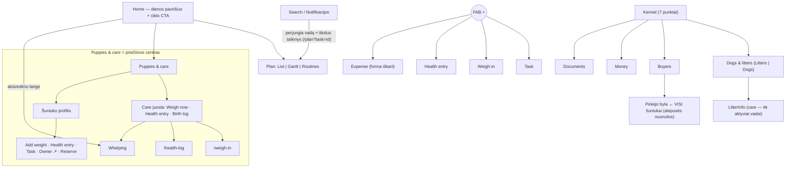

### 7.2 Galutinis prioritetų sąrašas (sulietas: A + B + Codex, po iššūkių raundų)

**TOP-10 (S/M/L = apimtis):**

| # | Pakeitimas | Apimtis | Stipriausia priežastis | Failai |
|---|---|---|---|---|
| 1 | **LitterInfo care veiksmai tik aktyviai vadai** — ne-terminalinei rodyti „Make this the current litter", terminalinei — read-only užrašą | S | Vienintelis radinys, leidžiantis **įrašyti duomenis ne tai vadai** | `LitterInfo.tsx` |
| 2 | **Puppies Care juosta + tuščios būsenos „Open birth log" CTA** | S | „Puppies & care" tabas šiandien neturi nė vieno care veiksmo | `Puppies.tsx` |
| 3 | **FAB sutvarkymas** (Note→Health entry; Expense→`?new=1`; slėpti `/whelping`) | S | Akivaizdžiausi mobilaus srauto lūžiai | `AppShell.tsx` |
| 4 | **Mobilios IA valymas**: `/docs`→Kennel žymėjimas; Kennel Menu 12→7 (po #2); Dogs/Litters suliejimas | M | Nuoseklus mentalinis modelis; `nav-state-active` principas | `AppShell.tsx`, `Menu.tsx` |
| 5 | **PuppyProfile veiksmingas**: owner nuoroda, Add weight (`?puppy=`), Health entry, Task | M | Didžiausia esybių aklavietė | `PuppyProfile.tsx`, `WeighIn.tsx` |
| 6 | **Pirkėjų srautas**: OwnerRecord — visi šuniukai; People filtrų pataisa (owner_id + waiting_list_for); Handover→edit nuoroda | M | Kelių šuniukų pirkėjas šiandien matomas neteisingai | `OwnerRecord.tsx`, `People.tsx` |
| 7 | **Dokumentų/negyvų paviršių valymas**: Search ieško uploads, slepia documents grupę; ištrinti `/all-*`, `Aggregates.tsx`, `TaskViewToggle` | M | Dvi „dokumentų visatos", viena be duomenų | `Search.tsx`, `AppShell.tsx`, — |
| 8 | **Vedlio kelių standartizacija**: Switcher→`/litters/new`; submit→`/plan`; `/litters` tuščia būsena be šunų→siųsti į `/dogs` | S/M | Nuoseklumas + naujo naudotojo aklavietė | `LitterSwitcherSheet.tsx`, `NewLitterWizard.tsx`, `Litters.tsx` |
| 9 | **Kontekstinis užduočių kūrimas — prefill pirmiausia** (be schemos; `subject_type/subject_id` — vėliau, kai įsitvirtins) | M | Follow-up veiksmai ten, kur kyla; be migracijos rizikos | `TaskFormSheet.tsx` + esybių ekranai |
| 10 | **Tikslūs deep-link'ai**: `/plan?task=<id>` atidaro detalę; Search/Notifikacijos perjungia vadą ir taiko tiksliai (kind→ref lookup, be migracijos) | M | „Atidaro apytiksliai" → „atidaro tą patį" | `Plan.tsx`, `Timeline.tsx`, `Search.tsx`, `Notifications.tsx` |
| 11 | Desktop prieiga prie šunų: `/litters` „Litters \| Dogs" segmentas | S | Desktope šunys nepasiekiami | `Litters.tsx` |

*(#11 — A audito radinys, Codex jo neįtraukė į top-10, bet desktopui jis būtinas; laikyti kartu su #4.)*

**Vidutinis prioritetas:** Health log `medication` + įrašų edit/delete + prefill iš šuniuko · Home atsivedimo lango CTA · mokėjimų/išlaidų edit · praeities svėrimų korekcija · „Reserve puppy" vedlys (pirkėjas+susiejimas+depozitas viename sraute) · sample vados pirkėjų duomenys (N5).

**Žemas prioritetas / backlog:** bendras svorio grafiko komponentas · šuns sveikatos įrašai (`dog_id`) · upload'ų susiejimas su šuniuku/pirkėju UI (schema jau paruošta; `dog_id` reikėtų migracijos) · Gantt lietimo taikinių didinimas (N8, a11y) · dokumentų unifikacija (kai generavimas atparkuotas — su „Contracts / Uploads / Missing data" sekcijomis pagal handoff SPEC.md:91).

**Įgyvendinimo tvarka:** 1-3 (S dydžio, didžiausias efektas) → 4-8 → 9-11. Dokumentų unifikacija ir task subject schema — atskiri, vėlesni sprendimai.

---

## 8. Taikyti UX principai

- **Veiksmas ten, kur jo reikia** — svėrimas/sveikata Puppies kontekste, ne „Kennel" meniu.
- **Esybės veiksmai prie esybės** — šuniuko profilis tampa veiksmo centru.
- **Jokių atskirų sekcijų sub-veiksmams** — `/weigh-in`, `/health-log`, `/whelping` lieka srauto ekranai be nav. punktų.
- **Mažiau dubliuotų įėjimų** — FAB be „Note", vienas vedlio kelias, vienas „visų X" vaizdas.
- **Nuspėjamas kūrimas** — FAB visada = „pridėti į šią vadą", 4 fiksuotos parinktys.
- **Greita prieiga dažniems veiksmams** — svėrimas ≤2 paspaudimais iš bet kur.
- **Navigacija — pagrindiniai objektai** — 4 tabai / 8 sidebar punktai nekinta.
- **Kontekstas niekada nesikeičia tyliai, bet ir nemeluoja** — LitterInfo care veiksmai arba taiko į tą vadą, arba aiškiai pasako, kodėl ne (`empty-nav-state` + `error-recovery` principai).
- **Tab žymėjimas atitinka mentalinį modelį** (`nav-state-active`) — `/docs` žymi Kennel.
- **Gyvavimo ciklas siūlo kitą žingsnį** — Home CTA pagal vados būseną (atsivedimo langas ir kt.).

---

## 9. Ginčų rezoliucijos (A vs B vs Codex)

| # | Klausimas | A pozicija | B pozicija | Sprendimas ir argumentas |
|---|---|---|---|---|
| 9.1 | **FAB** | Universalus fiksuotas | Per-ekranė kontekstinė matrica (9+ ekranų) | **Universalus** (A + Codex). ~75% mobilus mažos komandos naudojimas → nuspėjamumas svarbiau už aktualumą; kontekstą duoda ekranų callout'ai (§4), ne FAB. B matrica padarytų tą patį mygtuką reiškiantį skirtingus dalykus |
| 9.2 | **Mobilūs tabai** | 4 | 5 (su Docs) arba „Care/Business" | **4** (A + Codex). Docs — epizodinis; „Care/Business" laužo spec principą „tab label = ką atidaro". Bet B kryptis teisinga tuo, kad Puppies tabas turi TAPTI care centru (#2) |
| 9.3 | **Task subject modelis** | Prefill be schemos pirmiausia | `subject_type`/`subject_id` migracija | **Prefill pirmiausia, schema vėliau** (A + Codex; B „tikriausiai teisus vėliau"). Migracija tempia types/UI/detail backlink/search/notifikacijas — daryti tik kai kontekstiniai įėjimai pasiteisins |
| 9.4 | **Dokumentų unifikacija** | Atidėti iki generavimo atparkavimo; dabar slėpti negyvus paviršius | Unifikuoti dabar | **Atidėti** (A + Codex). Unifikacija dabar = parked funkcijos produktizavimas; pirmiausia paslėpti negyvą `documents` šaką ir įtraukti uploads į paiešką. B pastaba, kad `uploads` jau turi ryšio stulpelius — svarbi: unifikacijai migracijos beveik nereikės |
| 9.5 | **N1 pataisos būdas** | — | — | **Variantas C** (Codex, po iššūkio): LitterInfo care mygtukai tik aktyviai vadai; alternatyvos atmestos — (a) visada perjungti vadą tyliai laužo fokuso modelį (`SpaceProvider.tsx:206-216`), (b) `?litter=` param sukurtų dvi konteksto sistemas. Claude patikslinimas: vietoj plikos „disabled" — aktyvus „Make this the current litter" veiksmas ne-terminalinėms vadoms (`error-recovery`: duoti kelią, ne sieną) |
| 9.6 | **`/docs` tabo žymėjimas** | — | — | **Kennel** (Codex, po iššūkio): dokumentai — administracinis/verslo įrašas net kai litter-scoped; mobiliajame paleidžiami iš Kennel. Puppies ekranas lieka apie priežiūrą |
| 9.7 | **Gantt mobiliajame** | — | — | **Ne top-10** (Codex nusileido): spec §4.3 Gantt mobiliajame — antrinis. Bet liko faktas: 20px juostos = sub-44px taikiniai → a11y backlog (N8) |
| 9.8 | **Notifikacijų tikslumas** | — | — | **Be migracijos** (Codex nusileido): `kind` jau implikuoja ref tipą; pakanka kind→lookup→`/plan?task=<id>` (#10) |
