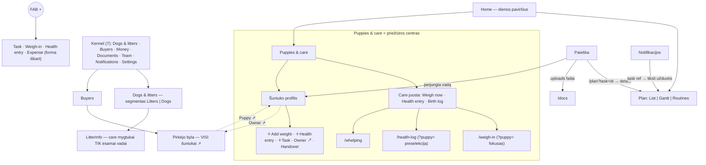

# UAT gidas — srautų pertvarka (2026-07-13 naktis)

**Kur testuoti:** staging peržiūra `https://breeders-app-git-staging-marty-inc.vercel.app` (staging DB; prisijunk arba pasidaryk „Test account A/B"). Prod **neliestas**.
**Kas įdiegta:** 3 commit'ai (`1b13908`, `9d5de06`, `54b5d34`) — E1 saugos paketas + E3 srautų pertvarka + pirkėjų/paieškos pataisos. Kiekvienas žemiau esantis scenarijus turi *laukiamą rezultatą* — žymėk ✅/❌.

---

## 1. Naujas srautų žemėlapis (po pertvarkos)

**Kas išnyko:** Kennel meniu punktai Whelping/Weigh-ins/Health log/Routines (dabar — Puppies Care juosta ir Plan tabai) · `/all-documents`, `/all-buyers`, `/all-expenses` maršrutai · FAB „Note" · `TaskViewToggle`.

---

## 2. UAT scenarijai

### A. „Atgal" gestas (Android) — svarbiausia nauja elgsena
Testuok telefone (arba naršyklės „atgal" mygtuku):
| # | Žingsniai | Laukiama |
|---|---|---|
| A1 | Home → FAB „+" → braukt „atgal" | Pasirinkimo langas užsidaro, lieki Home |
| A2 | FAB → „Task" → atsidaro forma → „atgal" | Forma užsidaro, lieki tame pačiame ekrane, programa neišeina |
| A3 | FAB → „Weigh-in" → svėrimo ekranas → „atgal" | Grįžti į ankstesnį ekraną (ne į FAB langą) |
| A4 | Bet kuris sheet'as (pvz., vados perjungiklis) → „atgal" | Sheet'as užsidaro |
| A5 | Be jokio atidaryto lango → „atgal" | Normali navigacija atgal |
| A6 | Formoje spausk „Save" ir IŠ KARTO „atgal" (lėtas ryšys) | Kol saugoma — langas neužsidaro |

### B. Rezultato langas iš Home (kritinis funkcinis fix'as)
| # | Žingsniai | Laukiama |
|---|---|---|
| B1 | Vada su suplanuotu progesterono testu šiandien → Home → pažymėk jį (UP NEXT „Done ✓" arba sąrašo apskritimu) | Atsidaro „Complete task" langas su rezultato įvedimu (NE tylus pažymėjimas) |
| B2 | Įvesk progesteroną ≥18 nmol/L su testo data | Pranešimas apie ovuliacijos patvirtinimą; datos perskaičiuojamos |
| B3 | Ultragarso užduotis iš Home → „pregnant" | Vados statusas → Pregnant |

### C. Puppies & care centras
| # | Žingsniai | Laukiama |
|---|---|---|
| C1 | Puppies ekranas (aktyvi vada) | Viršuje Care juosta: „Weigh now" · „Health entry" · „Birth log" |
| C2 | Vada be šuniukų → Puppies | Tuščia būsena su mygtuku „Open birth log" |
| C3 | Šuniuko profilis → „＋ Add weight" | Svėrimo ekranas su šiuo šuniuku fokuse |
| C4 | Šuniuko profilis → „＋ Health entry" | Sveikatos žurnalas su šiuo šuniuku pažymėtu „applies to" |
| C5 | Šuniuko profilis → „＋ Task" | Užduoties forma su pavadinimu „<šuniukas>: " |
| C6 | Šuniuko profilis, pirkėjo chip'as | Paspaudžiamas → atidaro pirkėjo bylą |

### D. Uždarytų vadų apsaugos
| # | Žingsniai | Laukiama |
|---|---|---|
| D1 | Pasirink uždarytą (closed) vadą kaip esamą → Docs / Money / Weigh-in / Health log | Aiškus užrašas „skaityti galima, rašyti ne"; nėra Upload/Add mygtukų; svėrimo įvedimo nėra |
| D2 | `/expenses?new=1` deep-link'as su uždaryta vada | Forma NEatsidaro |
| D3 | Atsidaryk NE esamą vadą per Litters sąrašą | Vietoj care mygtukų — „Make this the current litter" |
| D4 | Paspausk „Make this the current litter" (atidėtai vadai) | Vada tampa esama (ir reaktyvuota), atsiranda care mygtukai |

### E. Navigacija
| # | Žingsniai | Laukiama |
|---|---|---|
| E1 | Kennel tabas | 7 punktai (be Whelping/Weigh-ins/Health log/Routines) |
| E2 | `/docs` atidarytas | Apačioje pažymėtas **Kennel** tabas (ne Puppies) |
| E3 | Sidebar/Kennel „Dogs & litters" | Ekranas su segmentu „Litters \| Dogs" — persijungia į šunis |
| E4 | Vados perjungiklio „＋ New litter" | Atsidaro vedlys ant `/litters/new` |
| E5 | Sukūrus vadą vedliu | Nukelia į **Plan** |
| E6 | Nauja paskyra be šunų → Litters | Tuščia būsena siunčia „＋ Add your dogs" |
| E7 | FAB parinktys | Task · Weigh-in · Health entry · Expense („Note" nebėra); Expense atidaro formą iš karto |
| E8 | Atsivedimo ekranas (`/whelping`) | FAB nerodomas |

### F. Pirkėjai ir paieška
| # | Žingsniai | Laukiama |
|---|---|---|
| F1 | Pirkėjas su 2 šuniukais → jo byla | Matosi ABU šuniukai su nuorodomis į profilius |
| F2 | Buyers sąrašo vados filtras | Rodo ir rezervavusius (ne tik waiting list) |
| F3 | Handover checklist be pirkėjo | Mygtukas „Link an owner →" nuveda į šuniuko redagavimą |
| F4 | Handover checklist be kainos | Aiškus užrašas, kad reikia nustatyti kainą pirkėjo byloje |
| F5 | Paieška: užduoties pavadinimas → rezultatas | Atsidaro Plan su TOS užduoties detalės langu |
| F6 | Paieška: įkelto failo pavadinimas | Randamas „Documents" grupėje; atidaro `/docs` su tinkama vada |
| F7 | Paieška: kitos vados šuniukas → atidaryk | Vados fokusas persijungia (FAB dabar prideda į TĄ vadą) |

### D2. Papildomos apsaugos (po antro QA raundo)
| # | Žingsniai | Laukiama |
|---|---|---|
| D5 | Archyvuota vada kaip esama → Birth log | Tik skaitymui: nėra „Start whelping" / „Puppy born" / „Finish" |
| D6 | Vedlys `/litters/new` → Cancel → „atgal" | Vedlys NEatsidaro iš naujo |
| D7 | Paieška → kito vados užduotis → Edit | Redagavimas naudoja TOS vados datas (vada persijungė) |
| D8 | Rezultato saugojimas nutrūkus ryšiui | Langas lieka atidarytas su klaida (ne „lyg išsaugota") |

### G. Regresija (turi veikti kaip anksčiau)
| # | Kas | Laukiama |
|---|---|---|
| G1 | Plan tabai List/Gantt/Routines | Veikia; Gantt „New task"/„Repeat" veikia |
| G2 | Svėrimo srautas (All/1-by-1, auto-advance, užbaigimo kortelė) | Nepakitęs |
| G3 | Atsivedimo žurnalas (start gate, gimimai, Finish su peržiūra) | Nepakitęs |
| G4 | Datų keitimas LitterInfo su kaskados peržiūra | Skaičius atitinka realiai pasislinkusias užduotis |
| G5 | Notifikacijos: weight alert → weigh-in; whelping started → birth log | Veikia, vada persijungia |

---

## 3. Žinomi apribojimai (ne klaidos)
- Sutarčių generavimas lieka parked — paieška ir Documents dirba tik su įkeltais failais.
- Task-tipo notifikacijos (assigned/comment) kol kas nekuriamos — deep-link kodas paruoštas ateičiai.
- Praeities svėrimų koregavimas ir sveikatos įrašų redagavimas/trynimas — kito etapo backlog'e.
- „Reserve puppy" vedlys (pirkėjas+susiejimas+depozitas vienu srautu) — suplanuotas, dar nedarytas.
